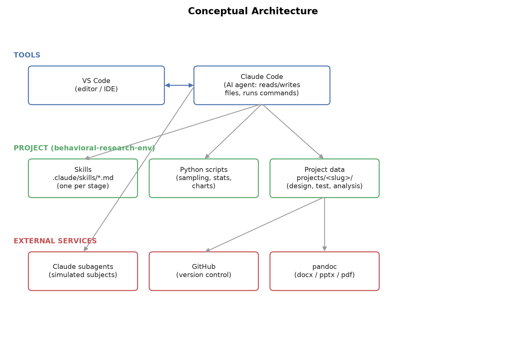
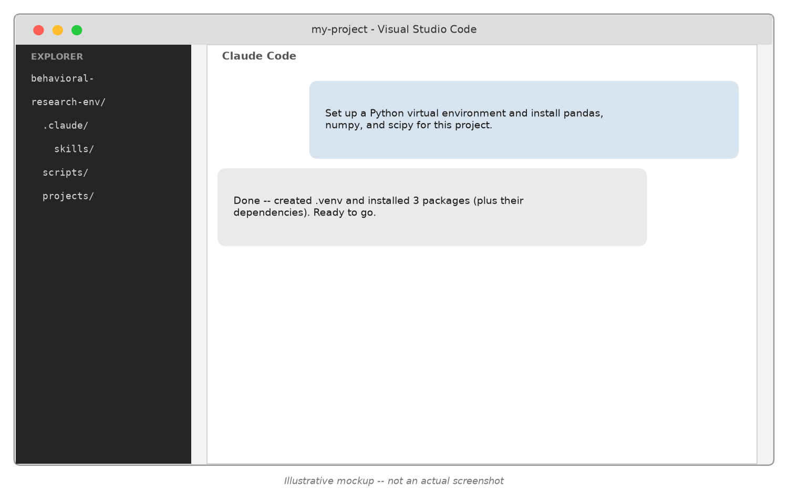
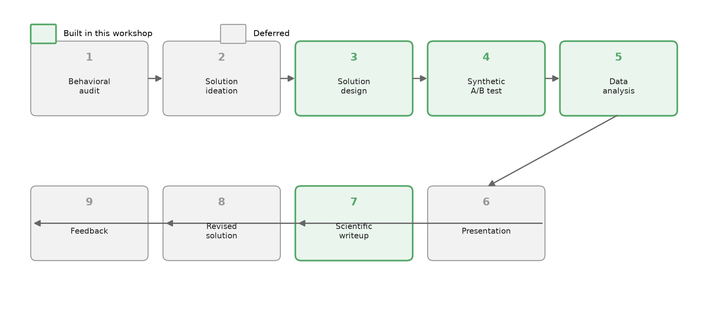
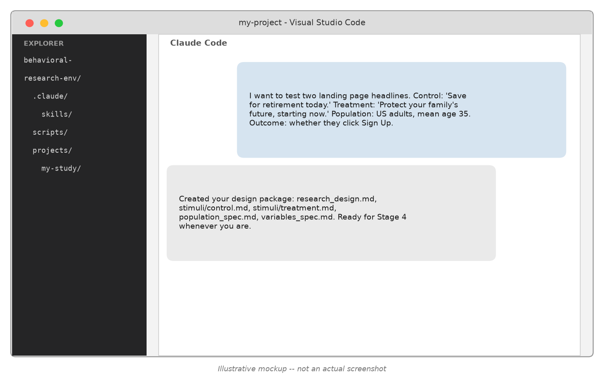
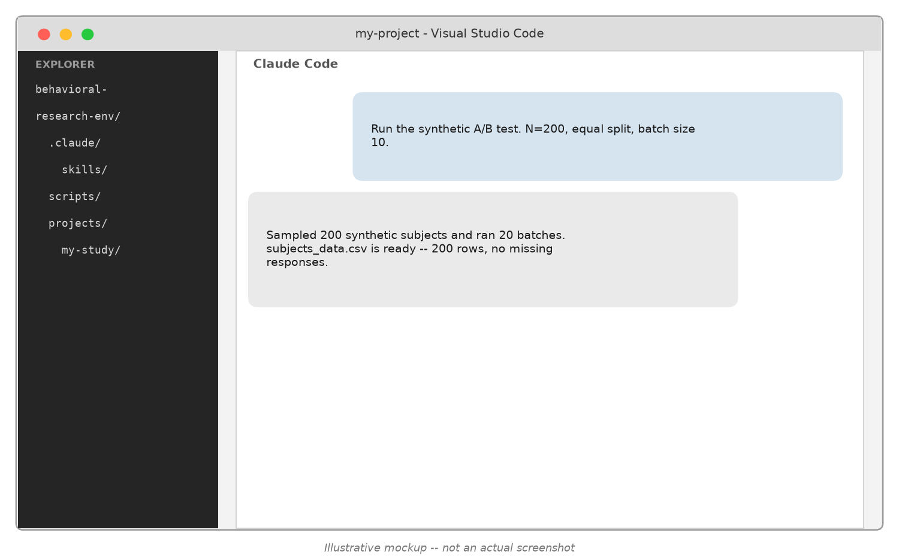
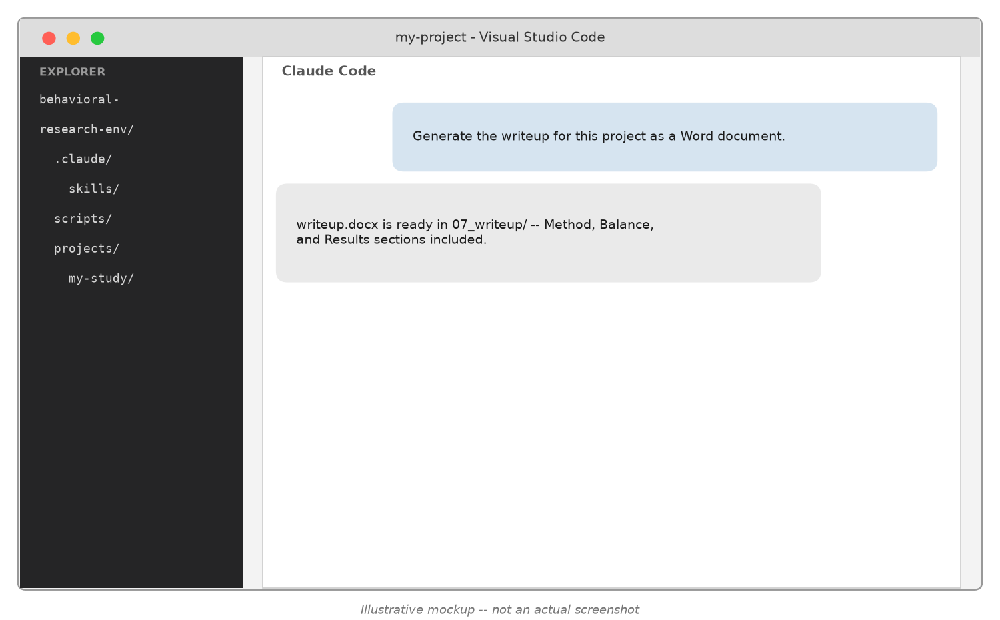

## Why simulate behavioral experiments with LLM agents?

- Real human studies are slow and costly to iterate on
- LLM-simulated subjects let you pressure-test a design *before* spending money on real recruitment
- Question we'll answer today: does a synthetic sample actually behave like a real one?
- Case study: a temporal reframing savings experiment, run twice (N=20, then N=400) and checked against a real published study

## Conceptual Architecture



## What is VS Code? What is Claude Code?

- **VS Code**: a code editor -- where you view/edit files, open a terminal, browse the project
- **Claude Code**: an AI agent that runs inside (or alongside) VS Code
  - Reads and writes files, runs terminal commands, executes Python scripts
  - Follows **Skills** -- written instructions for a specific recurring task
  - Can spawn **subagents**: independent Claude conversations for parallel work (this is how we simulate many subjects at once)
- You talk to Claude Code in plain English; it takes the actions

## What it looks like in practice



## How to read the rest of this deck

- The next few slides show this same pattern for every research stage: a chat mockup first, plain and simple
- Slides marked *"Under the hood"* are optional depth for the curious -- skip them if plain English is all you need
- Nothing under the hood is required reading to use the workflow yourself

## Tooling stack *(under the hood)*

- **Python** -- sampling, statistics, chart generation (pandas, numpy, scipy, statsmodels, matplotlib)
- **git + GitHub** -- version control, collaboration, backup
- **VS Code + Claude Code** -- the environment this all runs in
- **pandoc** -- converts markdown into docx / pptx / pdf (used for writeups, this deck, and the workbook)
- All of it installed and configured *by* Claude Code, conversationally -- you don't have to type any of what follows yourself

## Concrete setup, warts and all *(under the hood)*

- `python -m venv .venv` then `pip install -r scripts/requirements.txt`
- `git init`, then `gh repo create --private --source=. --push`
- Real snags hit along the way (useful to know, not just theory):
  - `winget install` needed `--scope user` to dodge an admin-elevation prompt that silently failed in a non-interactive shell
  - PATH changes don't persist between separate terminal commands -- each one needs its own PATH refresh
  - pandoc needs `--resource-path` to find images referenced by relative path

## Resulting project layout *(under the hood)*

```
behavioral-research-env/
  .claude/skills/          <- one SKILL.md per workflow stage
  scripts/
    synthetic_sample/      <- population sampling, batch building
    analysis/               <- balance check, regression, charts
  projects/
    <study-slug>/
      03_design/            <- stimuli, population spec, variables
      04_synthetic_test/    <- sampled subjects, responses, data
      05_analysis/          <- balance report, regressions, charts
      07_writeup/           <- generated writeup (md + docx)
```

## The 9-stage behavioral research pipeline



## Scoping calls: what we built, and why

- **Built**: Stages 3, 4, 5, 7 -- the empirical core (design -> test -> analyze -> write up)
- **Deferred**: Stages 1, 2, 6, 8, 9 -- audit/ideation/presentation/revision/feedback need more conversational nuance than a fixed pipeline
- **Deferred within Stage 5**: mediation and moderation analysis -- real methods (Query Theory, floodlight analysis), cut for v1 scope, not because they don't matter
- Lesson: scope a v1 tightly around what you can validate end-to-end

## Design principle: each stage is a Skill

- A **Skill** = a markdown file (`SKILL.md`) with a name, a description (when to use it), and instructions
- Claude Code reads the skill and follows it like a checklist/procedure
- Heavy lifting (statistics, sampling) lives in **Python scripts** the skill calls out to
- Why split it this way: skills handle judgment and conversation; scripts handle anything that needs to be exactly reproducible

## What a Skill actually looks like

This project's real `behavioral-design/SKILL.md` (trimmed):

```
---
name: behavioral-design
description: Stage 3 of the behavioral research workflow. Use when
  the user wants to set up a control-vs-treatment behavioral test...
---

## Required inputs

1. Control condition stimulus
2. Treatment condition stimulus
3. Population to sample
4. Outcome variable

Do not ask about idea generation, alternative conditions, or design
strategy -- there is exactly one control and one treatment condition.
```

- `name` + `description` tell Claude Code *when* to use this skill
- The body is plain-English instructions -- not code

## Stage 3 in practice



## Stage 3: design intake *(under the hood)*

- Researcher provides: control stimulus, treatment stimulus, population description, outcome variable(s)
- Skill validates completeness, asks only about genuine gaps
- Produces a structured design package: `research_design.md`, `stimuli/*.md`, `population_spec.md`, `variables_spec.md`
- Deliberately *not* a full ideation engine -- this version assumes the researcher already knows what they want to test

## Stage 4 in practice



## Stage 4: population sampling *(under the hood)*

- Demographics + individual differences sampled from researcher-specified means/SDs (age, income, financial literacy, numeracy...)
- Correlated variables drawn via a **Gaussian copula** so specified correlations (e.g. income <-> financial literacy) are respected
- Ordinal/count variables (income bracket, literacy score) rounded to valid values
- Random, independent assignment to condition -- same mechanics as a real RCT

## Stage 4: subagent batching + blinding *(under the hood)*

- Each **subagent** simulates a batch of ~10 subjects in one call -- batching matters:
  - Batch size 2: ~9,875 tokens/subject
  - Batch size 10: ~2,588 tokens/subject (**~4x more efficient**)
- Subjects respond in-persona based on their sampled profile, not as "an AI"
- **Blinding feature**: conditions can be tracked under neutral labels (Condition A/B) until the researcher chooses to reveal which is treatment -- avoids analyst bias

## Stage 4: what the data actually looks like *(under the hood)*

Every simulated subject becomes one row of `subjects_data.csv` (real rows shown, from this workshop's own N=400 run):

| subject_id | age | condition | choice | affordability | clarity |
|---|---|---|---|---|---|
| S00001 | 32.3 | condition_1 (treatment) | Yes, start saving | 5 | 6 |
| S00005 | 28.9 | condition_2 (control) | Not now | 3 | 4 |

## Stage 5 in practice


## Stage 5: analysis pipeline *(under the hood)*

- **Balance check** -- are demographics/individual differences actually balanced across conditions? (chi-sq, F-test, Bartlett's)
- **Regression** -- OLS or logit, with/without controls, on the primary and secondary outcomes
- **Charts** -- outcome-by-condition bar charts with standard errors
- A real bug caught here: pandas 3.0's new string dtype silently broke a dtype check -- always verify assumptions on real output, don't trust silently

## Stage 7 in practice



## Stage 7: writeup + reference comparison *(under the hood)*

- Assembles Method, Balance, and Results sections from the Stage 5 outputs into a single document
- Markdown -> **pandoc** -> Word (.docx)
- Optional section: compare this run's statistics against a **published reference study**, with an explicit, stated classification rule (replicates / partially replicates / does not replicate)
- Mediation/moderation excluded, matching Stage 5's scope

## The design: temporal reframing

> "Investing on a regular basis is one of the best ways to grow your wealth. You can get started with **$5 a day** today." *(treatment)*
>
> "...with **$150 a month** today." *(control)*

- Same underlying amount ($5/day ~= $150/month), different framing granularity
- Outcome: sign-up decision + self-reported affordability + self-reported understandability (both 1-7 Likert)

## Pilot: N=20, blinded

- 10 subjects/condition, subagent mode, condition labels withheld from the analyst
- Sign-up rate: 80% vs. 40% -- directionally large, but only marginal at this N (p ~ .08 across all three outcomes)
- Purpose of a pilot: catch pipeline problems and get a directional read cheaply before committing to a larger run

## Unblind, then decide to scale

- Researcher reveals: Condition 1 = treatment ($5/day), Condition 2 = control ($150/month)
- Re-run regressions with the correct reference category -- coefficients flip sign as expected, same magnitude
- Decision: scale to N=400 (200/condition) to get a properly powered read

## Full-scale results (N=400)

- Sign-up rate: **64.5% (treatment) vs. 45.5% (control)**, logit B=0.82, *p*<.001
- Affordability rating: 4.66 vs. 4.05, *p*<.001
- Understandability rating: 5.35 vs. 5.31, *p*=.70 (no effect)
- Balance check flagged gender as imbalanced (p=.035) -- across 6 tests, ~26% chance of at least one false positive; verified main results hold with a gender control

## The reveal

This project's population statistics and stimulus wording turned out to match a **real published study** exactly (Shu, Thomas & Smith, 2021, N=601 human crowdworkers):

| Outcome | Real study | This synthetic run |
|---|---|---|
| Savings decision | B=0.72, p=.002 | B=0.82, p<.001 -- **replicates** |
| Affordability | β=1.23, p<.001 | β=0.64, p<.001 -- **replicates, ~half size** |
| Understandability | β=0.49, p=.001 | β=0.04, p=.70 -- **does not replicate** |

## Takeaways

- Synthetic LLM-simulated subjects can reproduce a real behavioral effect's **direction and significance** for a choice outcome
- They may **understate effect sizes** even when direction replicates (affordability)
- They can **miss a mechanism entirely** (understandability) -- a reminder that synthetic samples are a tool for iteration, not a substitute for real data
- Practical toolkit: skills + subagents + Python + pandoc, all orchestrated conversationally

## Questions?

- Repository: this workshop's `behavioral-research-env` project
- Workbook handout has copy-paste prompt templates for every stage
