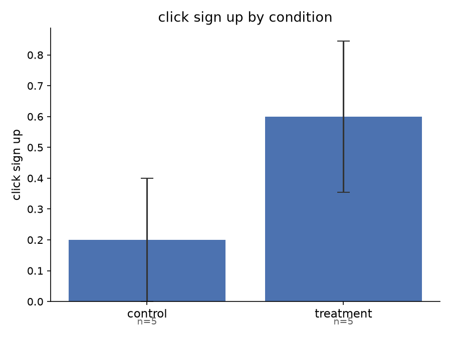

# Research Report: pilot-test-1

## Method

### Sample
The sample comprised $N = 10$ synthetic participants generated via Large Language Model (LLM) simulation in batched subagents. Subject profiles were drawn randomly from a parameterized population model representing US adults with a specified mean age of 35.0 years ($SD = 10.0$, bounded within $[18, 85]$). 

Participants were randomly assigned between-subject in an equal allocation ratio to either the control condition ($n = 5$) or the treatment condition ($n = 5$). Simulations were conducted using subagent batches with distinct persona conditioning, eliciting independent choice decisions and first-person reasoning without cross-subject contamination.

### Design and Stimuli
The experiment employed a two-condition, between-subjects randomized design evaluating the impact of beneficiary framing on financial savings decisions. Each participant was presented with a savings prompt followed by a binary decision whether to sign up:

- **Control condition:** Presented the baseline savings prompt:
  > *"Save $5 today."*
- **Treatment condition:** Presented the savings prompt augmented with beneficiary / family framing:
  > *"Save $5 today — for your family's future."*

Both conditions presented identical decision options: `"Not now"` versus `"Sign Up"`.

### Outcome Variable
The primary dependent variable was sign-up uptake (`click_sign_up`), recorded as a binary choice:
- `0` = Declined / chose `"Not now"`
- `1` = Accepted / chose `"Sign Up"`

---

## Summary Statistics and Balance

Randomization balance across conditions was evaluated on the sampled demographic covariate (age). Table 1 reports descriptive statistics by condition arm and across the overall sample.

### Table 1: Sample Demographics by Condition

| Condition | $n$ | Age Mean | Age $SD$ | Min | Max |
|:---|:---:|:---:|:---:|:---:|:---:|
| **Control** | 5 | 33.20 | 11.39 | 18 | 44 |
| **Treatment** | 5 | 30.60 | 6.54 | 22 | 38 |
| **Overall** | 10 | 31.90 | 8.86 | 18 | 44 |

A one-way ANOVA F-test indicates that mean age did not differ significantly between the control and treatment conditions ($F(1, 8) = 0.196, p = 0.670$). Additionally, Bartlett's test confirmed homogeneity of variance across conditions ($\chi^2(1) = 1.041, p = 0.308$). Randomization was therefore well-balanced with respect to age.

---

## Results

### Primary Outcome: Sign-Up Uptake (`click_sign_up`)

A binary logistic regression was estimated modeling the log-odds of signing up as a function of the treatment indicator ($0 = \text{Control}, 1 = \text{Treatment}$):

$$\text{logit}(P(\text{click\_sign\_up} = 1)) = -1.386 + 1.792 \times \text{Treatment}$$

In the control condition, 20.0% of participants ($n = 1/5$, $SE = 20.0\%$) chose to sign up. In the treatment condition, sign-up uptake was 60.0% ($n = 3/5$, $SE = 24.5\%$).

The logistic regression estimate for the treatment effect was positive ($B = 1.792, SE = 1.443, z = 1.241, p = 0.214, 95\%\text{ CI } [-1.037, 4.621]$), corresponding to an odds ratio of $\text{OR} = 6.00$. In this small exploratory pilot sample ($N = 10$), this positive directional effect did not reach conventional statistical significance ($p = 0.214$).

Qualitative examination of participant reasoning indicates that participants in the treatment condition frequently referenced familial responsibilities (e.g., *“seeing 'for your family's future' really caught my attention with two kids at home”*), whereas younger unattached respondents found the prompt less personally relevant. While directionally supporting the hypothesis that relational framing boosts perceived value, confirmatory testing with a higher-powered sample size is required to substantiate the statistical significance of this effect.

