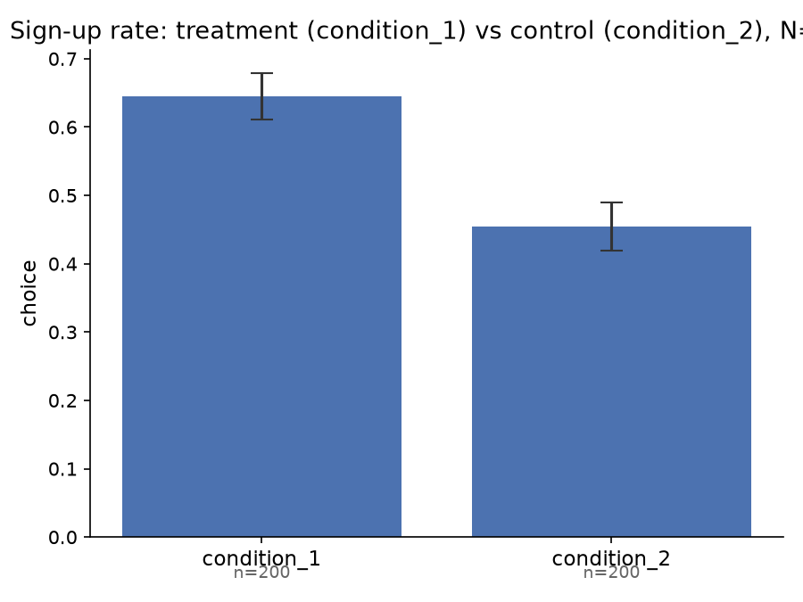
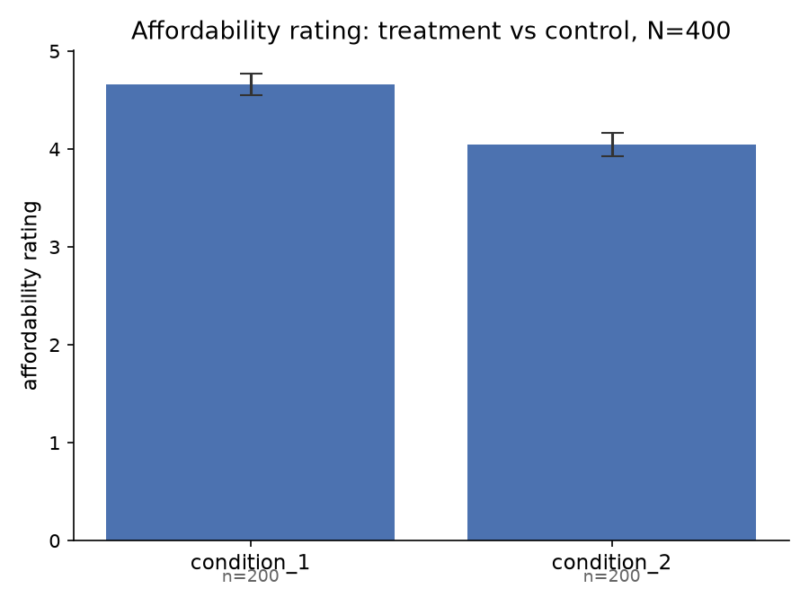
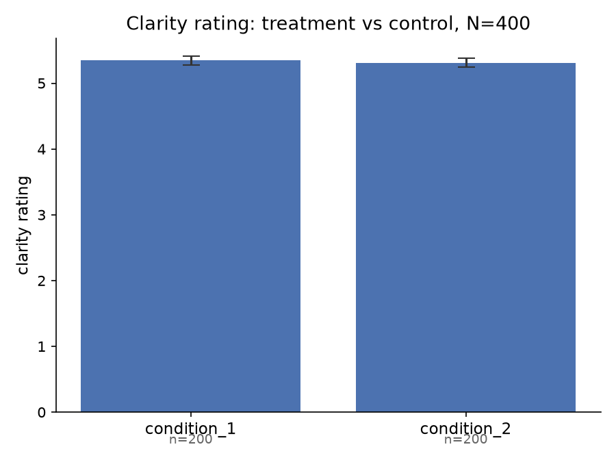

## Method

**Sample.** 400 synthetic subjects were generated via LLM simulation (Claude subagents, batches of 10 profiles per call) and randomly assigned between-subject to one of two conditions (200 per condition). Subject profiles were sampled to match the published population statistics of a crowdworker sample (Shu, Thomas, & Smith, 2021, Table 1): age *M*=34.29 (*SD*=7.24, clipped to 18-85), 52.3% male, income coded on the same 16-point ordinal bracket scale ($9,999 or less to $150,000+; *M*=5.29, *SD*=3.2), education (26.29% high school, 59.40% college, 14.31% advanced degree), financial literacy on the 3-item Lusardi & Mitchell scale (*M*=2.36, *SD*=0.91), and subjective numeracy on the SNS-3 scale (*M*=13.96, *SD*=3.12, range 3-18). Demographic and individual-difference variables were sampled independently (no cross-correlations specified).

**Design.** Between-subject, two conditions, differing only in how a recurring savings amount was framed:

- **Treatment** ("$5 a day"): *"Imagine you are using the app, and it tells you 'Investing on a regular basis is one of the best ways to grow your wealth. You can get started with $5 a day today.'"*
- **Control** ("$150 a month"): identical framing with *"$150 a month"* in place of *"$5 a day"*.

Both conditions shared an identical preamble describing a mobile financial-services app (round-up savings, one-time deposits, and pre-designed risk/return portfolios) before the framing manipulation.

**Outcome variables.**
- **Primary (choice):** binary decision, "Not now" vs. "Yes, start saving," coded start-saving = 1.
- **Secondary (affordability_rating):** 7-point Likert response to "I found the option to be affordable" (1 = strongly disagree, 7 = strongly agree).
- **Secondary (clarity_rating):** 7-point Likert response to "I found the description of the option to be clear and understandable" (1-7, same anchors).

Each simulated subject also produced a free-text response listing three things they were thinking about when offered the savings choice (not analyzed in this writeup).

## Summary Statistics and Experimental Balance

| | Treatment ($5/day, n=200) | Control ($150/mo, n=200) | Balance test |
|---|---|---|---|
| Age | 34.20 (6.95) | 34.45 (7.15) | F=0.12, p=.726; Bartlett's=0.16, p=.690 |
| % Male | 48.0% | 59.0% | χ²=4.43, p=.035 |
| Income bracket (1-16) | 5.10 (2.88) | 5.61 (2.95) | F=3.06, p=.081; Bartlett's=0.11, p=.740 |
| Education (HS/college/advanced) | 30.5% / 55.0% / 14.5% | 24.5% / 61.0% / 14.5% | χ²=1.93, p=.381 |
| Financial literacy (0-3) | 2.25 (0.76) | 2.28 (0.80) | F=0.15, p=.701; Bartlett's=0.56, p=.455 |
| Subjective numeracy (3-18) | 14.02 (2.89) | 13.89 (2.87) | F=0.20, p=.652; Bartlett's=0.01, p=.910 |

An F-test does not reject the null hypothesis that means for age, income bracket, financial literacy, or subjective numeracy are the same between conditions, and Bartlett's tests do not reject equal variances for any of these. A chi-squared test does not reject equal education proportions across conditions (p=.381). Gender, however, was imbalanced (χ²=4.43, p=.035): the treatment condition skewed more female (52% vs. 41%). Across six balance tests at α=.05, at least one false positive is expected roughly 26% of the time by chance, so this is plausibly (though not certainly) a chance imbalance rather than evidence of a sampling defect; all regression results below are reported both with and without a gender control to check robustness.

## Results

### Primary outcome: savings decision

Using a logistic regression with the control condition ($150/month) as the reference level, the treatment ($5/day framing) had a significant positive effect on the likelihood of choosing to start saving, both without controls (B=0.778, SE=0.205, *p*<.001) and with a gender control (B=0.817, SE=0.208, *p*<.001; gender itself was not significant, B=0.317, *p*=.127). The raw sign-up rate was 64.5% under treatment versus 45.5% under control.

### Secondary outcome: self-reported affordability

Using OLS with the control condition as the reference level, treatment significantly increased self-reported affordability, both without controls (β=0.615, SE=0.159, *p*<.001) and with a gender control (β=0.639, SE=0.160, *p*<.001; gender not significant, β=0.217, *p*=.176). Mean affordability rating was 4.66 under treatment versus 4.05 under control.

### Secondary outcome: self-reported understandability

Using OLS with the control condition as the reference level, treatment had no detectable effect on self-reported understandability, either without controls (β=0.035, SE=0.095, *p*=.712) or with a gender control (β=0.037, SE=0.095, *p*=.702; gender not significant, β=0.013, *p*=.890). Mean clarity rating was 5.35 under treatment versus 5.31 under control.

## Comparison to Reference Study

Reference: Shu, S., Thomas, S., & Smith, D. (2021). *Temporal Reframing of Recurring Savings Reduces Perceived Pain and Helps Those With Lower Financial Literacy to Save.* Working Paper, City, University of London. Daily-vs-monthly framing comparison, N=601 human crowdworkers recruited via Amazon TurkPrime, with demographic controls (age, gender, income, education).

Classification rule: **Replicates** = same sign, both *p*<.05. **Partially replicates** = same sign, significant in only one of the two studies. **Does not replicate** = opposite sign, or the reference effect was significant while this run's estimate is near zero.

| Outcome | Reference study (w/ controls) | This run (w/ gender control) | Assessment |
|---|---|---|---|
| Savings decision (logit) | B=0.716, SE=0.226, *p*=.002 | B=0.817, SE=0.208, *p*<.001 | **Replicates.** Same direction, both significant; this run's estimate is somewhat larger. |
| Affordability (OLS) | β=1.234, SE=0.176, *p*<.001 | β=0.639, SE=0.160, *p*<.001 | **Replicates**, but at roughly half the effect size of the reference study. |
| Understandability (OLS) | β=0.491, SE=0.142, *p*=.001 | β=0.037, SE=0.095, *p*=.702 | **Does not replicate.** The reference study found a significant, meaningful increase in perceived clarity under daily framing; this synthetic run found essentially no effect. |

The synthetic sample reproduces the reference study's central finding -- daily framing increases stated savings intentions -- at a comparable or slightly larger magnitude, and reproduces the direction (though not the full magnitude) of the affordability effect. It fails to reproduce the understandability effect: real subjects rated the daily-framed option as meaningfully clearer than the monthly-framed one, while simulated subjects rated the two as essentially equally clear. This suggests the synthetic pipeline captures affordability-driven framing effects on choice reasonably well, but may not capture whatever real-subject process made granular framing read as *more comprehensible* -- a channel this synthetic sample did not pick up on.

Mediation (subjective/objective affordability as mediators of the framing-to-choice path) and moderation (financial literacy as a moderator) analyses from the reference study are not computed in this run.
